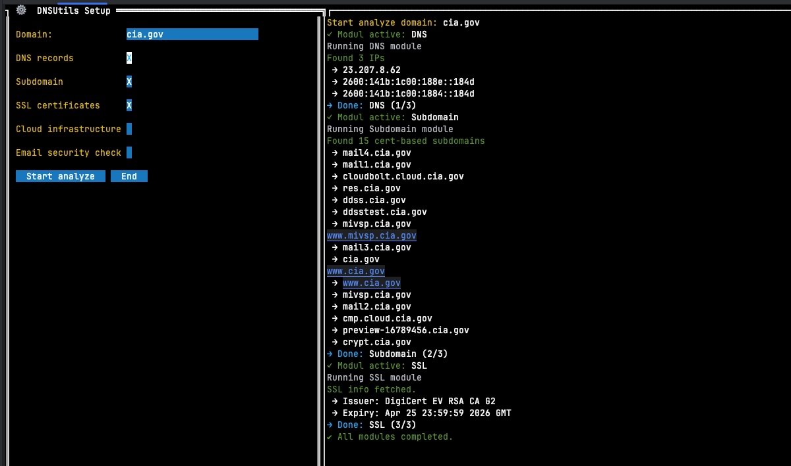

# DNS Reconnaissance Tool

A powerful DNS reconnaissance and subdomain discovery tool written in Go, designed for penetration testers, red teamers, and security researchers. Performs comprehensive OSINT gathering including DNS records, subdomain enumeration from multiple sources, WHOIS, DNSSEC validation, zone transfer testing, subdomain takeover detection, HTTP security header analysis, and more.

[](https://github.com/tldr-it-stepankutaj/dnsutils/releases)
[](https://goreportcard.com/report/github.com/tldr-it-stepankutaj/dnsutils)
[](https://opensource.org/licenses/MIT)

## Features

### DNS & Infrastructure
- 🔍 **DNS record enumeration** — A, AAAA, MX, TXT, CNAME, NS, SOA
- 🔓 **DNS Zone Transfer (AXFR) testing** — tests all nameservers for misconfigured zone transfers
- 🛡️ **DNSSEC validation** — checks DNSKEY, DS, RRSIG records and validates chain of trust
- 🕵️ **DNS cache snooping** — non-recursive queries to detect cached records on nameservers
- 📋 **WHOIS lookup** — registrar, dates, nameservers, DNSSEC status via raw WHOIS protocol

### Subdomain Discovery
- 📜 **Certificate Transparency** — subdomain enumeration via crt.sh
- 🌐 **Passive sources** — HackerTarget, AlienVault OTX, URLScan.io, Wayback Machine, RapidDNS
- 🔨 **Brute-force** — ~500 built-in prefixes or custom wordlist
- 🔄 **Recursive discovery** — finds sub-subdomains from discovered hosts
- 🃏 **Wildcard DNS detection** — automatically detects and filters wildcard responses
- 🔙 **Reverse DNS (PTR)** — PTR lookups for all discovered IPs

### Security Analysis
- ⚡ **Subdomain takeover detection** — 20+ service fingerprints (GitHub Pages, Heroku, S3, Azure, Shopify, Fastly, etc.)
- 🔒 **HTTP security headers** — checks HSTS, CSP, X-Frame-Options, CORP, COOP, Referrer-Policy, etc.
- 🏷️ **Technology fingerprinting** — detects CMS, frameworks, CDN, WAF, analytics (WordPress, React, Cloudflare, etc.)
- 📧 **Email security** — SPF, DMARC, DKIM, MX, CAA analysis with scoring and recommendations
- ☁️ **Cloud infrastructure detection** — AWS, Azure, GCP, DigitalOcean service identification and orphaned resource detection

### Output & Reporting
- 📊 **Clean, colorized console output** with formatted tables
- 💾 **JSON export** for scripting and automation
- 📄 **HTML report** — self-contained dark-themed report for pentest deliverables
- 🔧 **Port scanning and service fingerprinting**
- 🌐 **ASN lookup** for discovered IP addresses

## 🔳 Terminal UI (TUI)

DNSUtils includes a built-in **Text User Interface (TUI)** powered by [`rivo/tview`](https://github.com/rivo/tview).

### Launch it:

```bash
dnsutils -tui
```


## Installation

### Pre-built Binaries

Download the latest release from the [Releases page](https://github.com/tldr-it-stepankutaj/dnsutils/releases).

### Building from Source

#### Prerequisites

- Go 1.24 or later

#### Building

1. Clone the repository:
   ```bash
   git clone https://github.com/tldr-it-stepankutaj/dnsutils.git
   cd dnsutils
   ```

2. Build the binary:
   ```bash
   make build
   ```

   This will create a binary in the `bin` directory.

3. Or build for all platforms:
   ```bash
   make build-all
   ```

   This creates binaries for:
   - Linux (amd64, arm64)
   - macOS (amd64, arm64)
   - Windows (amd64)

## Usage

```bash
./bin/securitydns [options] domain
```

### Options

| Option | Description | Default |
|--------|-------------|---------|
| `-c int` | Concurrency level for scans | 40 |
| `-dns string` | DNS server to use for queries | `8.8.8.8:53` |
| `-o string` | Output file for results (JSON) | |
| `-html string` | Output file for HTML report | |
| `-p value` | Ports to scan (repeatable) | 80,443,22,21,25,8080,8443,53 |
| `-t int` | Timeout in seconds | 1 |
| `-v` | Verbose output | |
| `-w string` | Custom wordlist for brute-force | |
| `-tui` | Launch Terminal UI mode | |
| `-no-certs` | Skip CT log subdomain discovery | |
| `-no-bruteforce` | Skip brute-force subdomain discovery | |
| `-no-passive` | Skip passive subdomain sources | |
| `-no-recursive` | Skip recursive subdomain discovery | |
| `-no-whois` | Skip WHOIS lookup | |
| `-no-axfr` | Skip DNS zone transfer test | |
| `-no-dnssec` | Skip DNSSEC validation | |
| `-no-takeover` | Skip subdomain takeover detection | |
| `-no-headers` | Skip HTTP security header analysis | |
| `-no-reverse` | Skip reverse DNS lookups | |
| `-no-cachesnoop` | Skip DNS cache snooping | |
| `-no-security` | Skip email security analysis | |
| `-no-cloud` | Skip cloud infrastructure detection | |

### Examples

Basic full scan:
```bash
./bin/securitydns example.com
```

Full scan with JSON and HTML output:
```bash
./bin/securitydns -o results.json -html report.html example.com
```

Fast scan (skip slow modules):
```bash
./bin/securitydns -no-bruteforce -no-passive -no-headers -no-reverse example.com
```

Custom wordlist and ports:
```bash
./bin/securitydns -w wordlist.txt -p 80 -p 443 -p 8080 -c 100 -t 2 example.com
```

Only DNS + WHOIS + zone transfer (no subdomain enumeration):
```bash
./bin/securitydns -no-certs -no-bruteforce -no-passive -no-recursive example.com
```

## Project Structure

```
.
├── cmd
│   ├── main.go                 # Application entry point
│   └── security/main.go        # Standalone email security binary
├── internal
│   ├── asn/lookup.go           # ASN lookup (ipapi.co, ip-api.com)
│   ├── cloud/detector.go       # Cloud infrastructure detection
│   ├── dns
│   │   ├── resolver.go         # DNS record retrieval
│   │   ├── zonetransfer.go     # AXFR zone transfer testing
│   │   ├── dnssec.go           # DNSSEC chain validation
│   │   └── cachesnoop.go       # DNS cache snooping
│   ├── httpinfo
│   │   ├── headers.go          # HTTP security header analysis
│   │   └── techdetect.go       # Technology fingerprinting
│   ├── models/                 # Data structures
│   ├── output
│   │   ├── console.go          # Colorized console output
│   │   ├── json.go             # JSON export
│   │   ├── html.go             # HTML report generator
│   │   └── cloud.go            # Cloud results formatting
│   ├── scanner/portscanner.go  # Port scanning & service detection
│   ├── security/analyzer.go    # Email security (SPF/DMARC/DKIM/MX/CAA)
│   ├── ssl/certificate.go      # SSL certificate extraction
│   ├── subdomain
│   │   ├── certs.go            # CT log discovery
│   │   ├── passive.go          # Passive source aggregator
│   │   ├── bruteforce.go       # Brute-force enumeration
│   │   ├── takeover.go         # Subdomain takeover detection
│   │   ├── wildcard.go         # Wildcard DNS detection
│   │   └── reverse.go          # Reverse DNS (PTR) lookups
│   ├── tui/                    # Terminal UI (rivo/tview)
│   └── whois/lookup.go         # WHOIS protocol client
└── pkg/utils/utils.go          # Utility functions
```

## Changelog (v2.0.0)

- **WHOIS lookup** — registrar, dates, nameservers via raw WHOIS protocol (no external deps)
- **DNS Zone Transfer (AXFR)** — tests all NS for misconfigured zone transfers
- **DNSSEC validation** — DNSKEY/DS/RRSIG chain of trust verification
- **DNS cache snooping** — detects cached records on target nameservers
- **Subdomain takeover detection** — 20+ service fingerprints (GitHub Pages, Heroku, S3, Azure, Shopify, Fastly, Ghost, Zendesk, Fly.io, etc.)
- **HTTP security headers** — HSTS, CSP, X-Frame-Options, CORP, COOP, Referrer-Policy, Permissions-Policy
- **Technology fingerprinting** — CMS, frameworks, CDN, WAF, analytics detection (WordPress, React, Cloudflare, Akamai, etc.)
- **Passive subdomain sources** — HackerTarget, AlienVault OTX, URLScan.io, Wayback Machine, RapidDNS
- **Wildcard DNS detection** — automatic detection and filtering of wildcard responses
- **Recursive subdomain discovery** — finds sub-subdomains from CT logs
- **Reverse DNS (PTR)** — PTR lookups for all discovered IPs
- **HTML report generation** — self-contained dark-themed report for pentest deliverables
- **Expanded brute-force wordlist** — ~500 built-in prefixes (was 57)
- **Cloud infrastructure detection** — AWS, Azure, GCP, DigitalOcean service and orphaned resource detection
- **Email security scoring** — SPF, DMARC, DKIM, MX backup, CAA analysis

## License

This project is licensed under the MIT License - see the LICENSE file for details.

## Acknowledgments

- [miekg/dns](https://github.com/miekg/dns) - DNS library for Go
- [olekukonko/tablewriter](https://github.com/olekukonko/tablewriter) - ASCII table in Go
- [rivo/tview](https://github.com/rivo/tview) - Terminal UI library

---

## Author

This tool was developed by Stepan Kutaj (TLDR-IT). For more information or questions, contact me at [stepan.kutaj@tldr-it.com](mailto:stepan.kutaj@tldr-it.com) or visit my website at [www.tldr-it.com](https://www.tldr-it.com).

[](https://github.com/tldr-it-stepankutaj)
[](https://www.linkedin.com/in/stepankutaj)
[](https://buymeacoffee.com/stepankutae)

*For educational and legitimate security research purposes only. Always obtain proper authorization before performing reconnaissance on any systems.*
